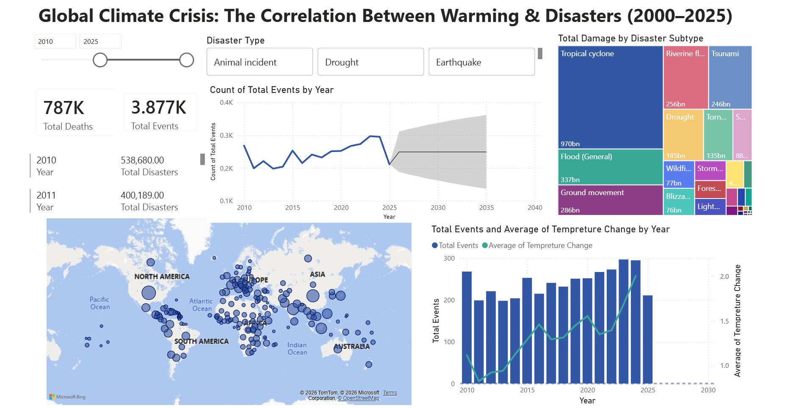
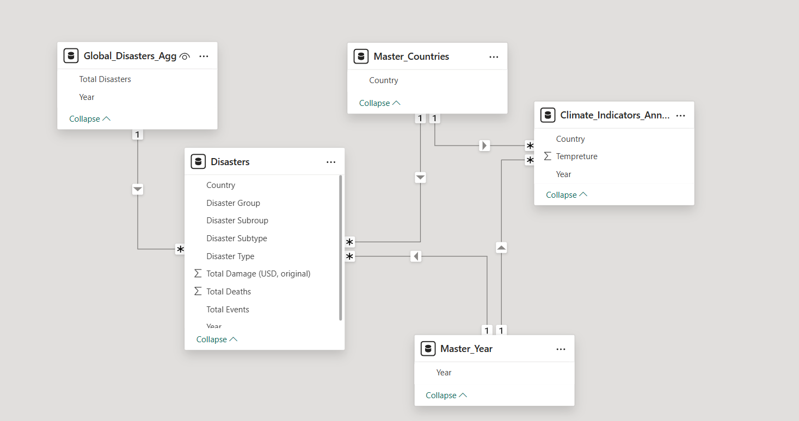
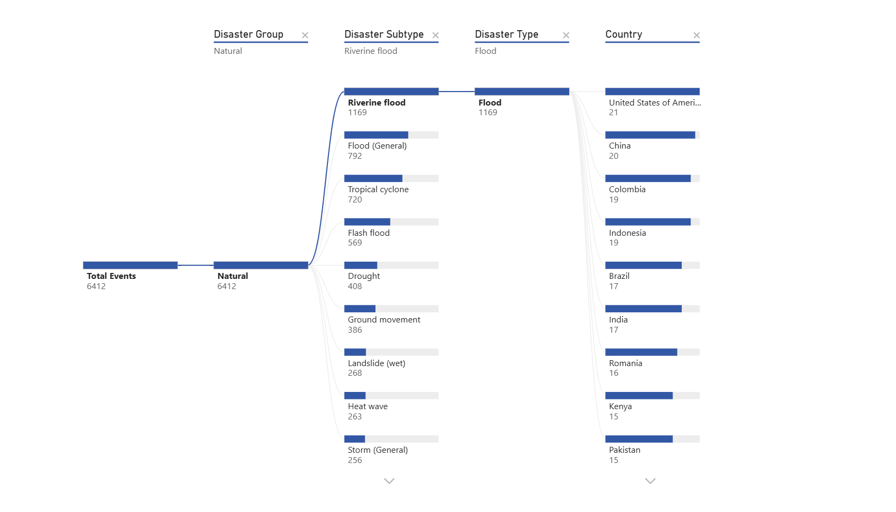

# Global Climate Crisis Analytics Dashboard (2000–2025)

### A Data Engineering Solution Analyzing the Correlation Between Rising Global Temperatures and Natural Disaster Frequency.

## 🚀 Live Demo

**[View Live Demo](https://app.powerbi.com/links/lbUl21BqkW?ctid=a6ec0f1c-2a34-41a9-ad11-2275a4888497&pbi_source=linkShare&bookmarkGuid=fc775775-c2d3-4b20-9dce-36c84cb2f94f)**

---

## 🧐 Project Overview

This project was initiated to answer a critical question using data instead of assumptions: **Is there a measurable, statistical correlation between the rise in global surface temperatures and the frequency/intensity of natural disasters over the last 25 years?**

To investigate this, I architected an end-to-end Business Intelligence solution. I ingested raw, unstructured data from disparate global sources (meteorological and disaster reporting agencies), engineered a robust data model to handle complex relationships, and developed an interactive Power BI dashboard to visualize the findings.

## 📊 Key Features & Insights

* **Geospatial Threat Mapping:** An interactive map identifying high-risk zones for 2025, pinpointing South Asia (specifically India & Sri Lanka) and North America as facing the highest "Threat Level" based on recent event density.
* **Dynamic Impact Tracking:** A "Lives Lost" KPI card that dynamically adjusts based on temporal and geospatial filters, highlighting the human cost in specific regions.

---

## 📸 Dashboard Visuals

Below are snapshots of the final analytical report and the underlying engineering.

### 1. Full Executive Dashboard Overview
*The complete layout featuring navigation, geospatial context, and trend analysis.*

### 2. The Data Engineering Model (Star Schema)
*The technical "engine room." This diagram shows how I resolved complex Many-to-Many relationships between Country and Year data by designing a Star Schema with intermediate "Bridge" dimension tables.*

### 3. AI-Powered Root Cause Analysis (Decomposition Tree)
*Leveraging Power BI’s AI engine, this visual autonomously breaks down "Total Deaths" to identify the primary drivers of casualties. It allows for ad-hoc exploration, revealing that while Floods are the most frequent event, specific subtypes in the South Asian region account for a disproportionate share of fatalities.*

---

## 🛠️ Technical Implementation Details

This project required solving several significant data engineering challenges:

### 1. ETL & Data Cleansing (Power Query/M)
* **Challenge:** The source temperature data was in a "wide" format (60+ columns for years 1960-2024) and contained redundant metadata.
* **Solution:** Utilized Power Query to **Unpivot** year columns into a normalized "tall" structure. Applied rigorous filtering to remove non-validated entries (e.g., `#date +occurred` garbage rows in the EM-DAT dataset).

### 2. Advanced Data Modeling (Handling M:N Relationships)
* **Challenge:** Both the Disaster table and Temperature table contained multiple rows per year and per country, creating a Many-to-Many (M:N) relationship that broke standard filtering.
* **Solution:** Architected a **Star Schema** approach. I created dedicated Dimension tables for `Master_Country` and `Master_Year` to act as "Bridges," enabling accurate, unidirectional filtering across both Fact tables without Cartesian product errors.

### 3. Interactive UX Design
* Implemented cross-filtering, allowing the user to click a country on the map to instantly filter all trend charts and KPIs to that specific region.

---

## 📂 Data Sources

* **Disaster Data:** EM-DAT (The International Disaster Database) – *Center for Research on the Epidemiology of Disasters (CRED).*
* **Temperature Data:** FAOSTAT / NASA GISS Surface Temperature Analysis.

---

## 👤 Author

- **Mihiranga**

* [Connect on LinkedIn](https://www.linkedin.com/in/mihiranga-dev/)
